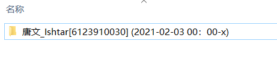

作者的bb：

本来是要备份自己微博，试了几个程序都不太满意（主要是存不了评论），就自己写了

有bug提issue，不会的话也可以直接找我，说清楚你爬的哪个链接，报的啥错（截图或者把报错内容复制出来），虽然最近可能不是很有空

作者联系方式

​		微博：@唐文_Ishtar（不过这个号过段时间就不用了）

​		邮箱：18975585675@163.com

------

微博爬虫，保存包括原链接、正文、评论等21个字段，尽可能保存所有信息

原计划保存为json和保存到mysql，由于时间原因只写了存为json

打包好的程序在software里，不用安装其他的东西，点击即可使用

一共两个程序：

**weibo_spider**：主程序，备份微博

download_img：如果要保存微博里的图片， 如果要保存微博里的图片，在主程序运行完后把这个放到结果文件夹里运行 

<a name="index">**目录**</a>
&emsp;<a href="#0">weibo_spider</a>  
&emsp;&emsp;<a href="#1">保存的内容</a>  
&emsp;&emsp;<a href="#2">使用</a>  
&emsp;&emsp;&emsp;<a href="#3">配置项简介</a>  
&emsp;&emsp;&emsp;<a href="#4">必填项</a>  
&emsp;&emsp;&emsp;<a href="#5">运行</a>  
&emsp;&emsp;&emsp;<a href="#6">可选项</a>  
&emsp;<a href="#7">download_img</a>  

&emsp;<a href="#9">给小白的变量类型介绍</a>   

## <a name="0">weibo_spider</a><a style="float:right;text-decoration:none;" href="#index">[Top]</a>

### <a name="1">保存的内容：</a><a style="float:right;text-decoration:none;" href="#index">[Top]</a>

| 键               | 含义                                      | 类型                |
| ---------------- | ----------------------------------------- | ------------------- |
| bid              | 微博bid，一条微博的唯一标识               | str                 |
| weibo_url        | 该条微博链接                              | str                 |
| user_id          | 用户id                                    | str                 |
| user_name        | 用户名                                    | str                 |
| content          | 微博正文                                  | str                 |
| public_time      | 发表时间                                  | str                 |
| public_timestamp | 发表时间戳                                | int                 |
| share_scope：    | 可见范围                                  | str                 |
| like_num         | 点赞数                                    | int                 |
| forward_num      | 转发数                                    | int                 |
| comment_num      | 评论数                                    | int                 |
| comment_list     | 评论信息列表                              | list，list 中为dict |
| is_original      | 是否为原创，原创为1，转发为0，快转为-1    | int                 |
| r_href           | 如果是转发微博，这里是原微博的url，否则空 | str                 |
| links            | 微博正文中包含的链接                      | list，list中为str   |
| img_list         | 图片链接列表                              | list，list中为str   |
| video_url        | 视频链接                                  | str                 |
| weibo_from       | 微博来源                                  | str                 |
| article_url      | 文章链接                                  | str                 |
| article_content  | 文章内容                                  | str                 |
| remark           | 备注                                      | str                 |

评论信息的字段

| 键              | 含义                                                      | 类型 |
| --------------- | --------------------------------------------------------- | ---- |
| content         | 评论内容                                                  | str  |
| user_name       | 评论人的名字                                              | str  |
| user_url        | 评论人主页链接                                            | str  |
| comment_date    | 评论时间                                                  | str  |
| comment_type    | 直接回复微博的评论为root评论，评论下的回复为child评论     | str  |
| parent_comment  | child_comment是回复了哪条评论，root评论无parent_comment， | str  |
| like_num        | 点赞数                                                    | int  |
| comment_img_url | 评论中带的图片链接                                        | str  |
| comment_link    | 评论中带的链接                                            | str  |

### <a name="2">使用</a><a style="float:right;text-decoration:none;" href="#index">[Top]</a>

配置文件：config.json

#### <a name="3">配置项简介</a><a style="float:right;text-decoration:none;" href="#index">[Top]</a>

| 配置项              | 描述                                             | 类型              | 必要/可选 |
| ------------------- | ------------------------------------------------ | ----------------- | --------- |
| user_id             | 要爬取用户的id                                   | str               | 必要      |
| all_page            | 该用户主页总页数                                 | int               | 必要      |
| cookies             | 就是cookies                                      | str               | 必要      |
| get_all_comment     | 获取当前用户所有评论                             | int               | 可选      |
| additional_user_ids | 其他要爬取所有评论的用户id                       | list，list中为str | 可选      |
| auto_get_increment  | 增量模式，自动获取新微博 （我觉得极其好用） | int               | 可选      |
| start_time          | 指定爬取时间范围                                 | int或str          | 可选      |
| stop_time           | 同上                                             | int或str          | 可选      |
| update_mode         | 更新模式（算是未完成）                           | int               | 可选      |
| update_start_time   | 更新开始时间                                     | int或str          | 可选      |
| print_level         | 输出等级                                         | int               | 可选      |

不知道类型是啥的人拉到最后，有写给小白的变量类型介绍

#### <a name="4">必填项</a><a style="float:right;text-decoration:none;" href="#index">[Top]</a>

**user_id**：

你要爬的人主页链接的这串数字

要注意的一点是，如果是有个性域名的不能直接拷域名，需要点进ta的任意一条微博，拷这段数字id

**all_page**：

你要爬那个人的主页一共有多少页，微博主页一下往下划拉，前两次会加载新的出来，第三次就有这个页数了
可以自动获取，但是怕请求失败也判定为没有下一页，所以还是手动填上去比较好（主要是懒，不想写了）

**cookies**

登录状态信息，没有这个只能获取到一页内容，也获取不到设置了分析范围的微博

获取方式：点开自己主页，按F12弹出开发者工具

点Network，点XHR，然后页面向下滑，右边会刷出一个开头是mbloglist的东西

点mbloglist，右边会弹出一些信息，往下滑，会有个很长一段的cookie，把这个复制出来就是（只复制蓝色选中部分）

#### <a name="5">运行</a><a style="float:right;text-decoration:none;" href="#index">[Top]</a>

这3个参数设置好之后可以运行了，运行阶段分为下载和解析，这两个过程都会自动保存进度，程序中断后再启动可以直接从上次断的地方继续。不要在程序运行时修改配置。

在下载过程中不要发新微博，会导致重复保存或者保存不到最后一页。

程序运行会产生文件夹，文件夹以**用户名[用户id]**命名

里面会有四个文件

download.json：为下载的微博网页文件，不用动。里面是微博的html，会比较大一点，我的微博一共是6000条，80m。程序运行完可以手动删除。

schedule.json：程序进度文件。如果要运行增量模式或者更新模式（具体见可选项配置），需要先把这个文件删除再启动。

**result.json**：结果文件，存放要爬取的用户的微博，p1存成p2这样

**r_result.json**：存放转发微博的源微博，格式跟result.json一样，result.json中r_weibo的bid可以在r_result找到对应的源微博。

下面三张图：1. 微博截图，2. result.json中的该条微博，3. 通过bid在r_result.json中找到的源微博

#### <a name="6">可选项</a><a style="float:right;text-decoration:none;" href="#index">[Top]</a>

**get_all_comment**

是否获取全部当前用户的全部评论，1是获取全部，0则是只获取前15条。

如果你要爬的博主评论数都非常多（都超过1000）的话，不建议开，因为微博的评论获取是每15条一组，一组要发一次请求，非常耗时间。而且我并没有给评论获取设中断保存机制，爬评论的过程中断的话得从头开始爬。

.

**additional_user_ids**

除了当前用户外，还有哪些用户微博下的评论是需要全部爬取的。

list格式，列表中应为str

在开了get_all_comment时，只有user_id用户发的微博下的评论是会全部保存的。
如果你希望该用户转发微博的源微博下的评论也能全部保存，那么把源微博博主的id放进来，这个博主源微博的评论就会全部保存。

（为什么不能直设成保存所有源微博的评论？因为指不定就转过那种评论过百万条的微博，像是李医生那条，会极其耗时还不一定爬得完）

.

**auto_get_increment**：

增量模式，自动获取新微博。1为启动，0为关闭。

在运行过一次程序，result.json没有移走的情况下，打开这个选项再次运行，会自动读取上次获取最后一条微博的时间，并且爬取到它之后的微博增加到文件里。

我个人觉得非常好用

运行前需删除上一次的进度文件（schedule.json）

.

**start_time & stop_time**

格式：int — 毫秒级的时间戳，或 str — 格式为`%Y-%m-%d %H:%M`的日期

只爬取某一个时间段的微博，时间段为(start_time,stop_time]

手动设置start_time和stop_time生成的文件夹会带有时间段

只指定start_time就是从start_time爬到最后，只指定stop_time就是从最早爬到stop_time，图上是只指定了start_time的。

注意：auto_get_increment功能需要用到start_time和stop_time，且优先级高于手动设置的start_time和stop_time，如果同时开了auto_get_increment，设置的start_time和stop_time会被覆盖掉。

.

**update_mode & update_start_time**

更新模式，1启动，0关闭。需指定update_start_time，update_start_time格式同start_time。

会删除时间晚于update_start_time的内容，并重新获取这一部分

可以和手动设置start_time/stop_time同时使用
update_start_time晚于start_time时，更新范围为(update_start_time,stop_time]。
update_start_time早于start_time时，更新范围为(start_time,stop_time]。（完全没有必要这么做）

跟增量模式冲突，不可同时启用。

这个模式本来是用来更新评论的，但是时间不够了，就粗糙地做了个这个出来。

.

print_level：

输出等级，没啥用的配置项，调试的时候用的一个输出

------

## <a name="7">download_img</a><a style="float:right;text-decoration:none;" href="#index">[Top]</a>

如果要保存微博里的图，在主程序运行完后，把程序放到结果文件的文件夹里，点击运行 
会自动找出还没下载过的图片，所以中断后可以直接重启。

保存爬的博主发的图输1，即result.json中img_list下的图片链接，保存在imgs中。
保存博主转发微博的源微博的图输2，即r_result.json中img_list下的图片链接保存在r_imgs中。

## <a name="9">给小白的变量类型介绍</a><a style="float:right;text-decoration:none;" href="#index">[Top]</a>

int，就是数字 比如：

1

100

str，平常打的字，要用双引号或者英文单引号括起来，数字被括起来也是字符串，比如

"唐文"

"123"

"may the father of understanding guide us"

list，就是放在一起的一堆元素，用中括号括起来，逗号分割，长度不限。python的列表放啥都行，比如：

[1,2,3]

["test1","test2","fu*k"]

dict，键值对，两键值对之间用逗号隔开，键和值之间用分号，程序中的配置文件和结果文件都是这种格式，键和值的类型不限，比如

{"key1" : 1, "key2" : 2}

{"img_list" : ["link1","link2"] }

所有的符号都是英文符号，中文符号会报错

